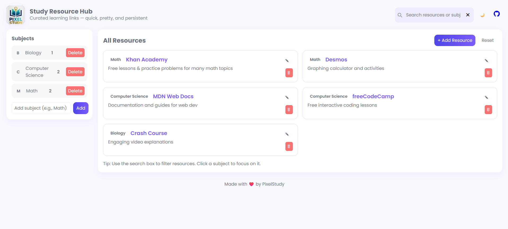

# PixelStudy
# 🎓 Study Resource Hub

A simple and interactive **web app** that helps students organize their study materials — all in one place.  
Built using **HTML, CSS, and JavaScript**, this app lets you **add, store, and manage** study subjects and resource links using **Local Storage** — no server needed!

---

## 🌍 Live Demo
👉 *https://pixel-study.vercel.app/*

---

## 📸 Preview

Here’s a quick look at PixelStudy in action:



*(If the image doesn’t render yet, it’s a placeholder for contributors to update.)*

---

## 🧩 Features
- 📘 Add new subjects with custom names  
- 🔗 Add useful study links under each subject  
- 💾 Automatically saved in your browser (Local Storage)  
- 🗑️ Delete subjects or individual links anytime  
- 🎨 Clean, responsive design  

---

## 🛠️ Tech Stack
- **HTML5**
- **CSS3**
- **JavaScript (Vanilla JS + LocalStorage API)**

---

## 🏆 Hacktoberfest 2025
This repository is participating in **Hacktoberfest 2025!**  
You’re welcome to contribute — whether you’re a beginner or experienced developer 💪  

### 🧃 Ways to Contribute
- Add new features (like dark mode, search bar, etc.)
- Improve UI/UX design
- Fix bugs or improve performance
- Enhance documentation (like this README)
- Add new ideas to the project

---

## 🚀 Getting Started

### 1️⃣ Fork this repo
Click on the **Fork** button (top right) to copy this repo into your GitHub account.

### 2️⃣ Clone your fork
```bash
git clone https://github.com/<your-username>/Study-Resource-Hub.git
